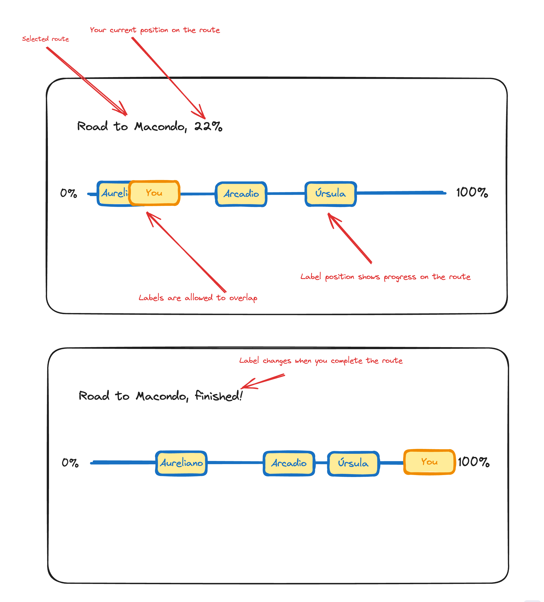

This is a simple route progress exercise built with [Next.js 14](https://nextjs.org/).
<br />
<br />

## Getting Started

First, run the development server:

```bash
pnpm dev
```
<br />
<br />


### UI Sketches
<div style="text-align:center;">

</div>
<br />
<br />

### Sample Response

The API endpoint returns mock data for positions on a fictional route, including your position and others.

```json
{
        "routeName": "Road to Macondo",
        "myPosition": 0.2,
        "peopleOnRoute": [
            {
                "name": "Arcadio",
                "position": 0.4
            },
            {
                "name": "Úrsula",
                "position": 0.25
            },
            {
                "name": "Aureliano",
                "position": 0.75
            }
        ]
    };
```